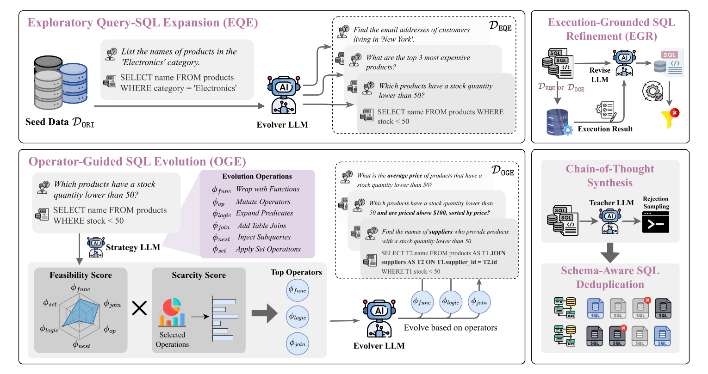

<h1 align="center">EvolSQL: Structure-Aware Evolution for Scalable Text-to-SQL Data Synthesis</h1>

<p align="center">
  <a href="https://2026.emnlp.org/"></a>
  <a href="https://arxiv.org/abs/2601.04875"></a>
</p>


This repository contains the official implementation of **EvolSQL**, a structure-aware data synthesis framework that evolves SQL queries from seed data into richer and more semantically diverse forms for training Text-to-SQL models.

## Overview

<p align="center">
  
</p>

Training effective Text-to-SQL models is hindered by the scarcity of high-quality, diverse, and structurally complex data. **EvolSQL** tackles this with a progressive evolution pipeline over three stages:

- **Exploratory Query-SQL Expansion (EQE).** An LLM expands seed examples into novel question–SQL pairs to broaden question diversity and schema coverage, refined with execution feedback for executability.
- **Operator-Guided SQL Evolution (OGE).** Six atomic transformation operators derived from the SQL AST progressively increase query complexity, guided by an adaptive strategy that balances feasibility and diversity.
- **Chain-of-Thought Solution Synthesis.** A teacher LLM synthesizes CoT traces via execution-verified rejection sampling, followed by schema-aware deduplication.

Fine-tuning a 7B model on the resulting data outperforms one trained on the much larger SynSQL dataset while using only 1/18 of the data.

## Repository Structure

- **`core/`** — Core utilities: a load-balanced OpenAI-compatible LLM client, SQL execution/verification, schema representation and extraction, and parallel helpers.
- **`pipeline/`** — Pipeline orchestration: configuration, the checkpoint-driven runner, and step registry. The actual step implementations live in **`pipeline/steps/`**.
- **`templates/`** — LLM prompt templates used by each pipeline step.
- **`schemas/`** — Schema files for the seed databases (provided for BIRD train).
- **`run_pipeline.py`** — Main entry point (the pipeline engine).
- **`run_pipeline.sh`** — Example launch script wrapping `run_pipeline.py`.

## Installation

```bash
pip install -r requirements.txt
```

EvolSQL calls LLMs through an OpenAI-compatible API, so you also need a serving backend. We use [vLLM](https://github.com/vllm-project/vllm):

```bash
pip install vllm
```

## Data Preparation

1. **Databases.** Place the source databases under a directory of your choice (passed via `--db_root_path`, e.g. `/path/to/db` containing `train_databases/`).

2. **Seed data.** Provide an input training file as a JSON list, where each item contains a natural language question and its gold SQL:

   ```json
   {
     "question_id": 0,
     "db_id": "movie_platform",
     "question": "Name the movie with the most ratings.",
     "evidence": "movie with the most rating refers to MAX(movie_popularity)",
     "SQL": "SELECT movie_title FROM movies ORDER BY movie_popularity DESC LIMIT 1"
   }
   ```

3. **Schemas.** The pipeline reads a schema file per database to prompt the LLM. Schema files for BIRD train are already provided under `schemas/` (`train_mschemas/` for the per-database files and `train_mschemas.jsonl` for the combined file).

Runtime artifacts are written to `results/` and `logs/`; create these directories (or let the pipeline create the run directory automatically).

## Quick Start

### 1. Serve a model

Start one or more OpenAI-compatible inference servers. For example, with vLLM:

```bash
vllm serve /path/to/your-model \
    --served-model-name Evolver \
    --port 8001
```

You can launch multiple instances on different ports; EvolSQL load-balances requests across them via the comma-separated `--api_urls` argument. Optionally, a different model can be used for rejection sampling through `--rs_api_urls` / `--rs_model`.

### 2. Run the pipeline

The simplest way is to edit the paths in `run_pipeline.sh` and run it:

```bash
bash run_pipeline.sh
```

Or invoke the Python entry point directly:

```bash
python run_pipeline.py \
    --run_name exp_v1 \
    --input_file ./data/seed_train.json \
    --output_dir ./results \
    --mschema_dir ./schemas/train_mschemas \
    --mschema_jsonl ./schemas/train_mschemas.jsonl \
    --db_root_path /path/to/db \
    --mode train \
    --api_urls http://localhost:8001/v1,http://localhost:8002/v1 \
    --model Evolver \
    --sentence_model /path/to/all-mpnet-base-v2 \
    --indep_rounds 2
```

The synthesized dataset is written under `results/<run_name>/`. Optionally, add `--enable_db_inject` to insert LLM-generated adversarial rows into a copy of each database before re-verification. This is useful when you need stricter execution-based validation, or when the databases are sparsely populated and a logically incorrect SQL might coincidentally return the same result as the gold SQL.
